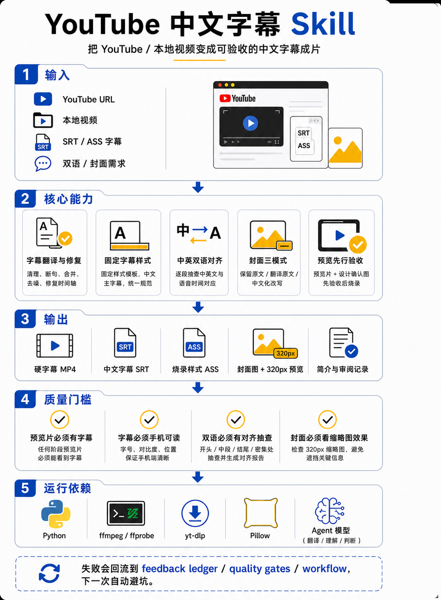

# YouTube 中文字幕 Skill

中文 | [English](README.en.md)

把 YouTube 视频或本地视频默认做成可复查、可修改、可复用的中英双语字幕成片：中文在上，英文在下。

这个 skill 不只是把文字压到画面上。它会保留字幕文件、烧录样式、封面素材、简介、预览片、截图和审阅记录，让一次视频处理可以被检查，也可以在后续继续修改。

## 功能

- 默认生成中英双语硬字幕 MP4，中文在上、英文在下
- 可按明确要求生成中文-only 硬字幕 MP4
- 保留可复用的 SRT 和 ASS 字幕文件
- 先做带字幕预览片，再做完整视频
- 检查字幕大小、位置、断句、重叠和手机可读性
- 可选保留并处理 YouTube 封面和简介
- 输出截图和审阅记录，方便确认最终结果

## 安装

推荐直接用一句命令安装：

```bash
npx skills add woodenxyz/youtube-cn-subtitle-burnin
```

安装后重启你的 agent 应用，然后直接提出视频处理需求即可。

### 手动安装

如果你的环境不能使用 `npx skills add`，可以用仓库里的打包文件安装到共享 skills 目录：

```bash
git clone https://github.com/woodenxyz/youtube-cn-subtitle-burnin.git
cd youtube-cn-subtitle-burnin
mkdir -p ~/.agents/skills
unzip -o dist/youtube-cn-subtitle-burnin.skill -d ~/.agents/skills
```

### 只给 Codex 使用

如果你只想让 Codex 发现这个 skill，可以安装到 Codex 自己的 skills 目录。

```bash
git clone https://github.com/woodenxyz/youtube-cn-subtitle-burnin.git
cd youtube-cn-subtitle-burnin
mkdir -p ~/.codex/skills
unzip -o dist/youtube-cn-subtitle-burnin.skill -d ~/.codex/skills
```

## 使用示例

```text
用 youtube-cn-subtitle-burnin，把这个 YouTube 视频做成双语字幕版。
需要保留 SRT 和 ASS，封面只加“中文字幕”和作者来源，不翻译原封面文字。
```

```text
用 youtube-cn-subtitle-burnin 做中文-only 硬字幕版。
不要加英文参考行，最终保留 MP4、SRT、ASS 和审阅截图。
```

## 你需要提供

- YouTube 链接，或本地视频文件
- 是否要覆盖默认双语模式，例如明确要求中文-only
- 是否需要处理封面
- 固定术语、产品名或翻译偏好

## 你会得到

- 带硬字幕的 MP4
- 中文字幕 SRT
- 烧录样式 ASS
- 双语模式下的英文 SRT 和双语 ASS
- 原始封面、编辑后封面和 320px 缩略图预览
- 原始简介和中文简介
- 预览片、设计确认图、最终截图和审阅记录

## 适合场景

- 把英文 YouTube 技术视频转成中文学习版
- 给课程、访谈、工具演示视频加中文字幕
- 制作中英双语版本，保留英文参考行
- 想保留字幕源文件，不只拿到一个烧录后的 MP4
- 希望每次视频都经过预览和截图检查

## 质量门槛

正式输出前应完成这些检查：

- 预览片里能看到字幕
- 字幕在手机尺寸下可读
- 字幕样式符合固定模板
- 双语字幕有中文、英文和语音时间的对应抽查
- 封面在 320px 缩略图下仍然清楚
- 最终 MP4 有正常音频、画面、截图和交付文件

## 依赖

- Python 3
- ffmpeg / ffprobe
- yt-dlp
- Pillow
- 一个能执行该 skill 的 agent 模型，用于翻译、判断和审阅

## 维护

这个仓库同时保存 skill 源码和打包文件。实际 skill 源码在 `youtube-cn-subtitle-burnin/`，打包文件在 `dist/youtube-cn-subtitle-burnin.skill`。

修改 `youtube-cn-subtitle-burnin/` 下的文件后，重新生成打包文件：

```bash
rm -f dist/youtube-cn-subtitle-burnin.skill
mkdir -p dist
zip -r dist/youtube-cn-subtitle-burnin.skill youtube-cn-subtitle-burnin
```

发布或安装前运行检查：

```bash
python3 -m py_compile youtube-cn-subtitle-burnin/scripts/*.py
for f in youtube-cn-subtitle-burnin/scripts/*.py; do python3 "$f" --help >/dev/null || exit 1; done
unzip -l dist/youtube-cn-subtitle-burnin.skill
```

如果要让本机 agent 立即使用最新版本，还要把 `youtube-cn-subtitle-burnin/` 同步到共享安装目录 `~/.agents/skills/youtube-cn-subtitle-burnin`，并确认两边内容一致。

## 流程概览



## License

MIT
